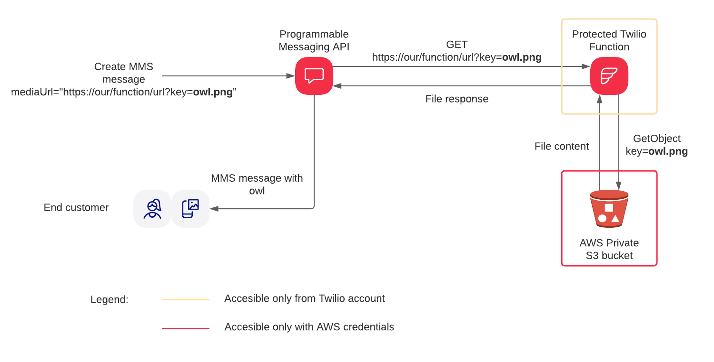

# mms-private-media

## Project summary

This project shows how you can leverage Twilio Function to protect your media attachments.

Multimedia messaging is getting more and more traction in the modern world.
It is not enough to send and receive texts; people want to share pictures, videos, voice recordings, documents, and much more.

Twilio already provides a number of channels that support sending media such as MMS, WhatsApp, and Facebook Messenger.
The only caveat?
The URL of the media file you want to send has to be a publicly accessible URL on the web.
With rising privacy and security awareness, that's not always an option – even if you're just sending a cinema ticket, you still don't want it to be stolen by somebody who has the URL.

Does that mean that you can't send multimedia messages to your customers?
Absolutely not!
This project shows how you can protect your media attachments while still being able to use them in multimedia messaging using protected serverless Twilio Functions.

For more details on the project head to the blogpost [here.](https://www.twilio.com/blog/secure-media-messaging-attachments-protected-twilio-functions)

## Diagram



## Developer environment setup
Make sure you have the software you need:

- [node.js](https://nodejs.org/) and [npm](https://docs.npmjs.com/downloading-and-installing-node-js-and-npm)
- [Twilio CLI](https://www.twilio.com/docs/twilio-cli/quickstart)
- [Twilio Serverless Toolkit](https://www.twilio.com/docs/labs/serverless-toolkit)

## Environment variables

```shell
ACCOUNT_SID=<Twilio Account SID>
AUTH_TOKEN=<Twilio Auth Token>
AWS_ACCESS_KEY_ID=<AWS credentials access key>
AWS_SECRET_ACCESS_KEY=<AWS credentials secret>
BUCKET=<AWS S3 bucket name>
REGION=<AWS region you created your bucket in>
```

## Available scripts
`npm run start` - starts project locally
`npm run deploy` - deploys project to Twilio Functions using credentials from .env file

## Tutorial
The blogpost with tutorial for this project you will find [here.](https://www.twilio.com/blog/secure-media-messaging-attachments-protected-twilio-functions)

## Disclaimer
The project published as-is as sample code.
